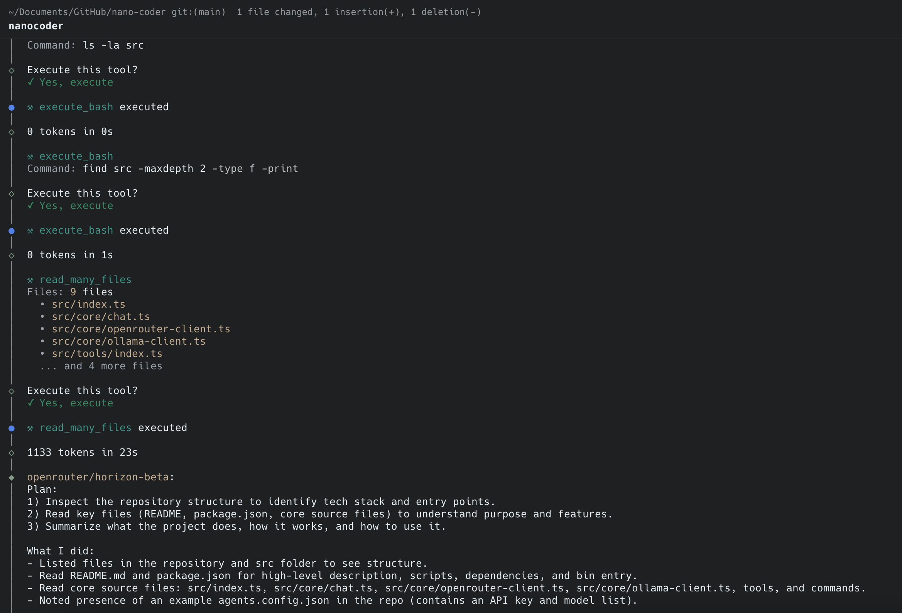

# Nanocoder

A local-first CLI coding agent that brings the power of agentic coding tools like Claude Code and Gemini CLI to local models or controlled APIs like OpenRouter. Built with privacy and control in mind, Nanocoder supports multiple AI providers with tool support for file operations and command execution.



## Installation

### For Users (Recommended)

Install globally and use anywhere:

```bash
npm install -g @motesoftware/nanocoder
```

Then run in any directory:

```bash
nanocoder
```

### For Development

If you want to contribute or modify Nanocoder:

**Prerequisites:**

- Node.js 18+
- npm

**Setup:**

1. Clone and install dependencies:

```bash
git clone [repo-url]
cd nanocoder
npm install
```

2. Build the project:

```bash
npm run build
```

3. Run locally:

```bash
npm run start
```

Or build and run in one command:

```bash
npm run dev
```

## Configuration

### AI Provider Setup

**Option A: Ollama (Local AI)**

```bash
ollama pull qwen3:0.6b  # or any other model
```

**Option B: OpenRouter (Cloud AI)**

Create `agents.config.json` in your **working directory** (where you run `nanocoder`):

```json
{
  "nanocoder": {
    "openRouterApiKey": "your-api-key-here",
    "openRouterModels": ["foo-model", "bar-model"]
  }
}
```

**Option C: OpenAI-Compatible APIs (Local or Remote)**

Configure any OpenAI-compatible API endpoint (e.g., LM Studio, Ollama Web API, vLLM, LocalAI, etc.):

```json
{
  "nanocoder": {
    "openAICompatible": {
      "baseUrl": "http://localhost:1234",
      "apiKey": "optional-api-key",
      "models": ["model-1", "model-2"]
    }
  }
}
```

Common OpenAI-compatible providers:
- **LM Studio**: `"baseUrl": "http://localhost:1234"`
- **Ollama Web API**: `"baseUrl": "http://localhost:11434"`
- **vLLM**: `"baseUrl": "http://localhost:8000"`
- **LocalAI**: `"baseUrl": "http://localhost:8080"`
- **Any OpenAI-compatible endpoint**: Just provide the base URL

### MCP (Model Context Protocol) Servers

Nanocoder supports connecting to MCP servers to extend its capabilities with additional tools. Configure MCP servers in your `agents.config.json`:

```json
{
  "nanocoder": {
    "mcpServers": [
      {
        "name": "filesystem",
        "command": "npx",
        "args": ["@modelcontextprotocol/server-filesystem", "/path/to/allowed/directory"]
      },
      {
        "name": "github",
        "command": "npx",
        "args": ["@modelcontextprotocol/server-github"],
        "env": {
          "GITHUB_TOKEN": "your-github-token"
        }
      },
      {
        "name": "custom-server",
        "command": "python",
        "args": ["path/to/server.py"],
        "env": {
          "API_KEY": "your-api-key"
        }
      }
    ]
  }
}
```

When MCP servers are configured, Nanocoder will:
- Automatically connect to all configured servers on startup
- Make all server tools available to the AI model
- Show connected servers and their tools with the `/mcp` command

Popular MCP servers:
- **Filesystem**: Enhanced file operations
- **GitHub**: Repository management
- **Brave Search**: Web search capabilities
- **Memory**: Persistent context storage
- [View more MCP servers](https://github.com/modelcontextprotocol/servers)

> **Note**: The `agents.config.json` file should be placed in the directory where you run Nanocoder, allowing for project-by-project configuration with different models or API keys per repository.

### Commands

The CLI supports several built-in commands:

- `/help` - Show available commands
- `/clear` - Clear chat history
- `/model` - Switch between available models
- `/provider` - Switch between AI providers (ollama/openrouter/openai-compatible)
- `/mcp` - Show connected MCP servers and their tools
- `/exit` - Exit the application

## Features

- **Multi-provider support**: Seamlessly switch between Ollama (local), OpenRouter (cloud), and any OpenAI-compatible API
- **Smart fallback**: Automatically falls back to available providers if one is unavailable
- **Tool calling**: AI can execute tools to interact with your system
  - File reading and writing
  - Bash command execution
  - **MCP (Model Context Protocol) servers**: Connect to any MCP server for extended capabilities
- **Interactive commands**: Built-in command system for managing the chat session
- **Colorised output**: Enhanced terminal experience with syntax highlighting
- **Model switching**: Change AI models on the fly

## Contributing

We're a small team building Nanocoder and would love your help! Whether you're interested in:

- Adding support for new AI providers
- Improving tool functionality
- Enhancing the user experience
- Writing documentation
- Reporting bugs or suggesting features

All contributions are welcome! Please feel free to:

1. Open an issue to discuss your idea
2. Fork the repository and create a pull request
3. Join discussions in existing issues

For development setup, see the [For Development](#for-development) section above.

## License

MIT License

Copyright (c) 2025 Mote Software Ltd

Permission is hereby granted, free of charge, to any person obtaining a copy
of this software and associated documentation files (the "Software"), to deal
in the Software without restriction, including without limitation the rights
to use, copy, modify, merge, publish, distribute, sublicense, and/or sell
copies of the Software, and to permit persons to whom the Software is
furnished to do so, subject to the following conditions:

The above copyright notice and this permission notice shall be included in all
copies or substantial portions of the Software.

THE SOFTWARE IS PROVIDED "AS IS", WITHOUT WARRANTY OF ANY KIND, EXPRESS OR
IMPLIED, INCLUDING BUT NOT LIMITED TO THE WARRANTIES OF MERCHANTABILITY,
FITNESS FOR A PARTICULAR PURPOSE AND NONINFRINGEMENT. IN NO EVENT SHALL THE
AUTHORS OR COPYRIGHT HOLDERS BE LIABLE FOR ANY CLAIM, DAMAGES OR OTHER
LIABILITY, WHETHER IN AN ACTION OF CONTRACT, TORT OR OTHERWISE, ARISING FROM,
OUT OF OR IN CONNECTION WITH THE SOFTWARE OR THE USE OR OTHER DEALINGS IN THE
SOFTWARE.
